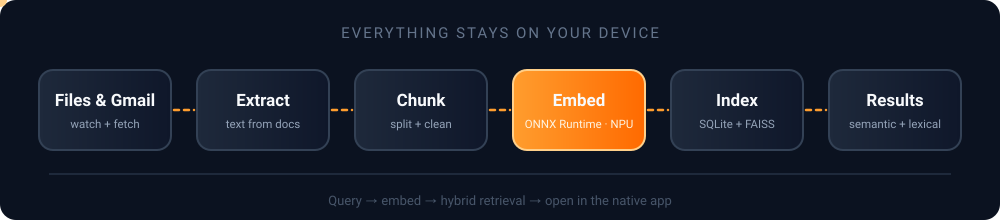
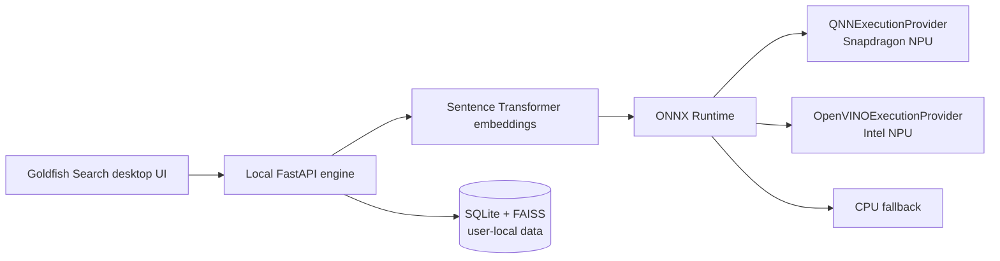

<div align="center">


<br />

<a href="https://www.qualcomm.com/snapdragon/ai-lab">
  
</a>
<a href="https://www.hp.com/">
  
</a>
<a href="https://github.com/YugRokadia/Goldfish">
  
</a>

<br />
<br />


<br />
<br />

**[Demo](#-see-it-in-action) · [Quick start](#-quick-start) · [How it works](#-how-it-works) · [Hardware](#-hardware-acceleration) · [Privacy](#-privacy-and-data-ownership) · [Roadmap](#-roadmap)**

</div>

> **Competition submission:** Goldfish Search is designed for the Snapdragon-powered HP PC AI use-case challenge. It turns scattered personal information into a fast, private, semantic search experience that runs locally and is prepared to use Qualcomm QNN acceleration on Snapdragon hardware.

---

## 💡 The idea

Important things disappear into folders, PDFs, notes, documents, and email threads. Goldfish Search continuously builds a searchable local memory from those sources, then lets a user ask for the thing they actually remember rather than the exact filename.

Instead of uploading private material to a remote search service, Goldfish extracts, indexes, and retrieves locally. The result is a quiet desktop search tool with the speed and privacy expected from an on-device AI application.

> *Why "Goldfish"?* The popular myth says a goldfish forgets everything after three seconds. Goldfish Search is the opposite: it remembers everything *for you*, so you don't have to.

## 🎬 See it in action

<div align="center">
  
</div>

<!--
  TODO (highest impact): replace or supplement the illustration above with a REAL screen recording.
  Record 10-15s, convert to GIF/WebP (or upload an mp4 in a GitHub issue and paste the link here), then:
  
-->

<!-- TODO: add 2-3 real screenshots (search window, settings, Gmail connect) in a table:
| Search | Results | Settings |
| --- | --- | --- |
|  |  |  |
-->

## ✨ Features

- 🔎 **Search by meaning.** Type "that pdf about the lease renewal" and find it, even if the filename is `scan_0042.pdf`.
- 🧬 **Hybrid retrieval.** Semantic embeddings combined with lexical matching, so exact terms and fuzzy memories both work.
- 🔒 **Local-first.** Documents, embeddings, and the vector index never leave your machine.
- ⚡ **NPU-accelerated.** ONNX Runtime provider routing for Snapdragon (QNN) and Intel (OpenVINO), with a CPU fallback.
- 👀 **Always current.** A filesystem watcher keeps the index fresh as files change.
- 📬 **Opt-in Gmail search.** Queried only for explicit email-oriented searches, using your own OAuth credentials.
- 🪟 **Opens in the right app.** Results launch in their native Windows application.

## 🧠 Why it belongs on an AI PC

| Challenge | Goldfish Search |
| --- | --- |
| Search by meaning, not only keywords | Semantic embeddings plus lexical retrieval |
| Keep personal data private | Local ingestion, local database, local vector index |
| Make AI feel immediate | Cached embeddings and an always-ready desktop surface |
| Use the hardware already in the laptop | ONNX Runtime provider routing for QNN and OpenVINO |
| Stay useful when an accelerator is unavailable | CPU/PyTorch fallback remains available |

## 🔧 How it works

<div align="center">
  
</div>

1. Goldfish watches selected local files.
2. Text is extracted from supported documents.
3. Content is chunked, embedded, and stored in the local index.
4. A natural-language query combines semantic and lexical retrieval.
5. Results open in their native Windows application.
6. Gmail is queried only for explicit email-oriented searches after account connection.

## 🚀 Hardware acceleration

Goldfish uses one embedding pipeline with a provider selected at runtime:



| Target | Runtime path | Status |
| --- | --- | --- |
| Intel NPU | ONNX Runtime + OpenVINO Execution Provider | ✅ Verified on development hardware |
| Snapdragon NPU | ONNX Runtime + QNN Execution Provider | 🟡 Source and packaging path prepared; hardware validation pending |
| Any supported Windows PC | PyTorch/CPU fallback | ✅ Available |

The default model is `sentence-transformers/all-MiniLM-L6-v2`, producing 384-dimensional normalized embeddings. The model is open-source and can be replaced with another compatible embedding model as the hardware target evolves.

### 📊 Benchmarks

Numbers make the NPU story concrete. Fill this in with your own measurements (leave "pending" rows honest until Snapdragon hardware is validated).

| Metric | CPU (PyTorch) | Intel NPU (OpenVINO) | Snapdragon NPU (QNN) |
| --- | --- | --- | --- |
| Embedding latency, single query | _TODO_ ms | _TODO_ ms | _pending_ |
| Indexing throughput (chunks/sec) | _TODO_ | _TODO_ | _pending_ |
| End-to-end search latency (p50 / p95) | _TODO_ | _TODO_ | _pending_ |
| Power draw while indexing | _TODO_ | _TODO_ | _pending_ |

<sub>Test setup: device, RAM, corpus size (documents / chunks), model, and Goldfish version. Add these so results are reproducible.</sub>

## 🔐 Privacy and data ownership

Goldfish is local-first by design:

- Documents and embeddings remain on the user's machine.
- Runtime data is stored per user in `%LOCALAPPDATA%\Goldfish Search` on Windows.
- Credentials and local indexes are excluded from Git.
- Gmail access is opt-in and uses the user's own OAuth credentials.
- The application does not require a hosted search backend.

| Data | Where it lives | Leaves the device? |
| --- | --- | --- |
| Document text and chunks | Local SQLite | No |
| Embeddings | Local FAISS index | No |
| Gmail results | Fetched on demand via your OAuth token | Only to Google's API, at your request |
| Telemetry / analytics | None | No |

<!-- TODO: confirm the table above matches reality (especially telemetry, and whether Gmail messages are cached locally). -->

## 📁 Project structure

```text
Goldfish/
├── apps/
│   ├── desktop/             # Tauri 2 + React desktop experience
│   │   └── src-tauri/       # Native window behavior and release packaging
│   └── engine/              # FastAPI, ingestion, retrieval, embeddings
├── assets/                  # README animations and images
├── scripts/                 # Build and utility scripts
└── data/                    # Local development data; ignored by Git
```

## ⚡ Quick start

**Prerequisites**

- Windows 10/11 (x64 or ARM64)
- Python 3.x and Node.js 18+ _(pin the exact versions you tested with)_
- Rust toolchain (required by Tauri 2)
- Optional: Intel NPU drivers (OpenVINO path) or Qualcomm QNN runtime (Snapdragon path)

### 1. Start the local engine

```powershell
cd apps/engine
.\.venv\Scripts\Activate.ps1

$env:RECALLX_EMBEDDING_BACKEND = "openvino"
$env:RECALLX_OPENVINO_DEVICE = "NPU"

python -m uvicorn app.main:app --host 127.0.0.1 --port 8000 --reload
```

For a CPU-only development run:

```powershell
$env:RECALLX_EMBEDDING_BACKEND = "torch"
```

### 2. Start the desktop app

In a second terminal:

```powershell
cd apps/desktop
npm install
npm run tauri dev
```

Health check:

```powershell
Invoke-RestMethod http://127.0.0.1:8000/health
```

### ⚙️ Configuration

| Variable | Purpose | Example |
| --- | --- | --- |
| `RECALLX_EMBEDDING_BACKEND` | Select the embedding runtime | `openvino`, `qnn`, `torch` |
| `RECALLX_OPENVINO_DEVICE` | OpenVINO target device | `NPU` |
| `RECALLX_QNN_BACKEND_PATH` | Path to the Qualcomm backend DLL | `C:\Path\To\QnnHtp.dll` |

<!-- TODO: consider renaming RECALLX_* to GOLDFISH_* (keep the old names as aliases) so the branding is consistent. -->

## 📦 Build a Windows installer

The release build bundles the Python engine and starts it automatically from the Tauri application. Development mode intentionally keeps the engine manual so iteration stays fast.

```powershell
cd apps/engine
.\.venv\Scripts\Activate.ps1
powershell -ExecutionPolicy Bypass -File .\build_windows.ps1

cd ..\desktop
npm install
npm run tauri build
```

Installer artifacts are written under:

```text
apps/desktop/src-tauri/target/release/bundle/
```

For a Snapdragon build, use a Snapdragon/ARM64 environment with the Qualcomm QNN runtime and set the real backend DLL path:

```powershell
$env:RECALLX_EMBEDDING_BACKEND = "qnn"
$env:RECALLX_QNN_BACKEND_PATH = "C:\Path\To\QnnHtp.dll"
```

The Intel and Snapdragon runtime wheels should be built in separate environments because they provide different ONNX Runtime execution providers.

## ✅ Validation

```powershell
cd apps/engine
python -c "from app.embeddings.model import embed_text; print(embed_text('Goldfish test').shape)"
```

Expected output:

```text
(384,)
```

Provider check:

```powershell
python -c "from app.embeddings.runtime import detect_runtime; import onnxruntime as ort; print(detect_runtime()); print(ort.get_available_providers())"
```

## 🛠️ Troubleshooting

<details>
<summary><b>The NPU isn't being used and everything runs on CPU</b></summary>

Run the provider check above. If `OpenVINOExecutionProvider` or `QNNExecutionProvider` is missing from the list, the wrong ONNX Runtime wheel is installed for your hardware. Create a fresh virtual environment per target.
</details>

<details>
<summary><b>The desktop app can't reach the engine</b></summary>

In development the engine is started manually. Confirm the health check returns OK on `http://127.0.0.1:8000/health` and that no other process is using port 8000.
</details>

<details>
<summary><b>Search returns nothing for files I know exist</b></summary>

Check that the folder is being watched and that the file type is supported. First-time indexing of large folders can take a while.
</details>

<!-- TODO: add real issues you hit while building (Tauri sidecar, DLL paths, ARM64 wheels) - these are the most valuable entries. -->

## ❓ FAQ

<details>
<summary><b>Does my data ever leave my computer?</b></summary>

Documents, embeddings, and the index stay local. The only network access is the opt-in Gmail search, made directly to Google with your own credentials.
</details>

<details>
<summary><b>Do I need an NPU?</b></summary>

No. Goldfish falls back to CPU automatically. The NPU makes embedding faster and more power-efficient.
</details>

<details>
<summary><b>Which file types are supported?</b></summary>

_TODO: list them (for example PDF, DOCX, TXT, MD)._
</details>

## 🏁 Competition alignment

Goldfish Search is submitted as an on-device AI productivity use case for Snapdragon-powered HP PCs. Its core application is deliberately practical: retrieve a user's own information quickly, privately, and by meaning. The implementation uses open-source models and ONNX Runtime provider routing so the same product can adapt to Snapdragon QNN acceleration while retaining a reliable fallback path.

The project is intended to be evaluated on:

- **Technical implementation:** local ingestion, hybrid retrieval, provider-aware embeddings, and a packaged desktop workflow.
- **Use case and innovation:** semantic search across the personal information people already struggle to find.
- **Deployment and accessibility:** one desktop surface, per-user storage, and an installable Windows application.
- **Presentation and documentation:** reproducible setup, explicit hardware paths, privacy boundaries, and transparent validation status.

> This repository is an entrant project and is not affiliated with, endorsed by, or sponsored by Qualcomm or HP. Challenge participation remains subject to the official rules and eligibility requirements.

## 🗺️ Roadmap

- [x] Local document ingestion and filesystem watching
- [x] SQLite and FAISS-backed retrieval
- [x] Desktop UI with Tauri and React
- [x] Intel OpenVINO NPU execution path
- [x] Packaged-engine build path
- [x] Snapdragon QNN validation on physical HP Snapdragon hardware
- [ ] First-run folder selection and onboarding
- [ ] Signed installer and release update channel

## 🤝 Contributing

Issues and pull requests are welcome. Before opening a PR, please run the validation steps above and describe which hardware path you tested (CPU, Intel NPU, or Snapdragon NPU).

## 🙏 Acknowledgements

- [Snapdragon AI Lab](https://www.qualcomm.com/snapdragon/ai-lab)
- [ONNX Runtime](https://onnxruntime.ai/)
- [OpenVINO](https://www.intel.com/content/www/us/en/developer/tools/openvino-toolkit/overview.html)
- [Sentence Transformers](https://www.sbert.net/)
- [Tauri](https://tauri.app/)
- [FastAPI](https://fastapi.tiangolo.com/)

## 📄 License

License terms have not been finalized yet. Do not treat this repository as granting permission to redistribute the code until a license is added.

<div align="center">
  <br />
  <sub>Built to remember, so you don't have to. 🐟</sub>
</div>
