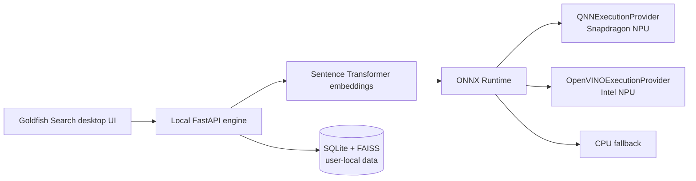

<div align="center">

# Goldfish Search

### Your files, emails, and ideas. One local search surface.

<a href="https://www.qualcomm.com/snapdragon/ai-lab">
  
</a>
<a href="https://www.hp.com/">
  
</a>
<a href="https://github.com/YugRokadia/Goldfish">
  
</a>

<br />
<br />


</div>

> **Competition submission:** Goldfish Search is designed for the Snapdragon-powered HP PC AI use-case challenge. It turns scattered personal information into a fast, private, semantic search experience that runs locally and is prepared to use Qualcomm QNN acceleration on Snapdragon hardware.

## The idea

Important things disappear into folders, PDFs, notes, documents, and email threads. Goldfish Search continuously builds a searchable local memory from those sources, then lets a user ask for the thing they actually remember rather than the exact filename.

Instead of uploading private material to a remote search service, Goldfish extracts, indexes, and retrieves locally. The result is a quiet desktop search tool with the speed and privacy expected from an on-device AI application.

## Why it belongs on an AI PC

| Challenge | Goldfish Search |
| --- | --- |
| Search by meaning, not only keywords | Semantic embeddings plus lexical retrieval |
| Keep personal data private | Local ingestion, local database, local vector index |
| Make AI feel immediate | Cached embeddings and an always-ready desktop surface |
| Use the hardware already in the laptop | ONNX Runtime provider routing for QNN and OpenVINO |
| Stay useful when an accelerator is unavailable | CPU/PyTorch fallback remains available |

## Hardware acceleration

Goldfish uses one embedding pipeline with a provider selected at runtime:



| Target | Runtime path | Status |
| --- | --- | --- |
| Intel NPU | ONNX Runtime + OpenVINO Execution Provider | Verified on development hardware |
| Snapdragon NPU | ONNX Runtime + QNN Execution Provider | Source and packaging path prepared; hardware validation pending |
| Any supported Windows PC | PyTorch/CPU fallback | Available |

The default model is `sentence-transformers/all-MiniLM-L6-v2`, producing 384-dimensional normalized embeddings. The model is open-source and can be replaced with another compatible embedding model as the hardware target evolves.

## Product flow

1. Goldfish watches selected local files.
2. Text is extracted from supported documents.
3. Content is chunked, embedded, and stored in the local index.
4. A natural-language query combines semantic and lexical retrieval.
5. Results open in their native Windows application.
6. Gmail is queried only for explicit email-oriented searches after account connection.

## Privacy and data ownership

Goldfish is local-first by design:

- Documents and embeddings remain on the user’s machine.
- Runtime data is stored per user in `%LOCALAPPDATA%\Goldfish Search` on Windows.
- Credentials and local indexes are excluded from Git.
- Gmail access is opt-in and uses the user’s own OAuth credentials.
- The application does not require a hosted search backend.

## Project structure

```text
Goldfish/
├── apps/
│   ├── desktop/             # Tauri 2 + React desktop experience
│   │   └── src-tauri/       # Native window behavior and release packaging
│   └── engine/              # FastAPI, ingestion, retrieval, embeddings
├── scripts/                 # Build and utility scripts
└── data/                    # Local development data; ignored by Git
```

## Run in development

### 1. Start the local engine

```powershell
cd apps/engine
.\.venv\Scripts\Activate.ps1

$env:RECALLX_EMBEDDING_BACKEND = "openvino"
$env:RECALLX_OPENVINO_DEVICE = "NPU"

python -m uvicorn app.main:app --host 127.0.0.1 --port 8000 --reload
```

For a CPU-only development run:

```powershell
$env:RECALLX_EMBEDDING_BACKEND = "torch"
```

### 2. Start the desktop app

In a second terminal:

```powershell
cd apps/desktop
npm install
npm run tauri dev
```

Health check:

```powershell
Invoke-RestMethod http://127.0.0.1:8000/health
```

## Build a Windows installer

The release build bundles the Python engine and starts it automatically from the Tauri application. Development mode intentionally keeps the engine manual so iteration stays fast.

```powershell
cd apps/engine
.\.venv\Scripts\Activate.ps1
powershell -ExecutionPolicy Bypass -File .\build_windows.ps1

cd ..\desktop
npm install
npm run tauri build
```

Installer artifacts are written under:

```text
apps/desktop/src-tauri/target/release/bundle/
```

For a Snapdragon build, use a Snapdragon/ARM64 environment with the Qualcomm QNN runtime and set the real backend DLL path:

```powershell
$env:RECALLX_EMBEDDING_BACKEND = "qnn"
$env:RECALLX_QNN_BACKEND_PATH = "C:\Path\To\QnnHtp.dll"
```

The Intel and Snapdragon runtime wheels should be built in separate environments because they provide different ONNX Runtime execution providers.

## Validation

```powershell
cd apps/engine
python -c "from app.embeddings.model import embed_text; print(embed_text('Goldfish test').shape)"
```

Expected output:

```text
(384,)
```

Provider check:

```powershell
python -c "from app.embeddings.runtime import detect_runtime; import onnxruntime as ort; print(detect_runtime()); print(ort.get_available_providers())"
```

## Competition alignment

Goldfish Search is submitted as an on-device AI productivity use case for Snapdragon-powered HP PCs. Its core application is deliberately practical: retrieve a user’s own information quickly, privately, and by meaning. The implementation uses open-source models and ONNX Runtime provider routing so the same product can adapt to Snapdragon QNN acceleration while retaining a reliable fallback path.

The project is intended to be evaluated on:

- **Technical implementation:** local ingestion, hybrid retrieval, provider-aware embeddings, and a packaged desktop workflow.
- **Use case and innovation:** semantic search across the personal information people already struggle to find.
- **Deployment and accessibility:** one desktop surface, per-user storage, and an installable Windows application.
- **Presentation and documentation:** reproducible setup, explicit hardware paths, privacy boundaries, and transparent validation status.

> This repository is an entrant project and is not affiliated with, endorsed by, or sponsored by Qualcomm or HP. Challenge participation remains subject to the official rules and eligibility requirements.

## Roadmap

- [x] Local document ingestion and filesystem watching
- [x] SQLite and FAISS-backed retrieval
- [x] Desktop UI with Tauri and React
- [x] Intel OpenVINO NPU execution path
- [x] Packaged-engine build path
- [ ] Snapdragon QNN validation on physical HP Snapdragon hardware
- [ ] First-run folder selection and onboarding
- [ ] Signed installer and release update channel

## Acknowledgements

- [Snapdragon AI Lab](https://www.qualcomm.com/snapdragon/ai-lab)
- [ONNX Runtime](https://onnxruntime.ai/)
- [OpenVINO](https://www.intel.com/content/www/us/en/developer/tools/openvino-toolkit/overview.html)
- [Sentence Transformers](https://www.sbert.net/)
- [Tauri](https://tauri.app/)
- [FastAPI](https://fastapi.tiangolo.com/)

## License

License terms have not been finalized yet. Do not treat this repository as granting permission to redistribute the code until a license is added.
